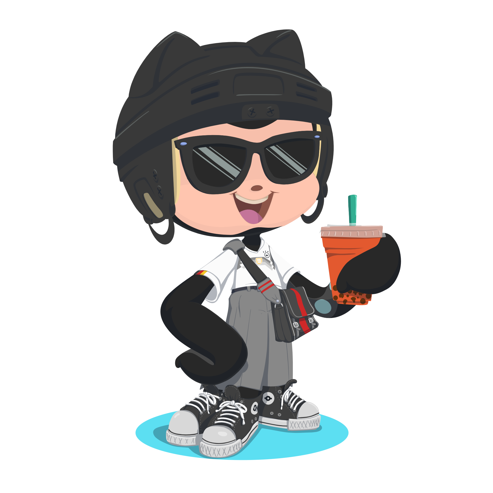

<h1 align="center">Hey I'm Anas Ismail ! 👋</h1>

###

 

  

###

  
  
  

###
 
<h2 align="left">Glad to see you here! 😊</h2>

###

I’m Anas Ismail, a Web Developer with 1 year of industry experience in creating responsive, dynamic applications with React, Next.js, and Django. My GitHub showcases projects like "Mail Dispatcher" and "Registration Onboarding," where I've focused on clean UI design, efficient data management, and seamless user experiences.

🔧 I enjoy working with JavaScript-based applications, building reusable components, and optimizing applications for performance and SEO. I'm passionate about learning and actively expanding my knowledge in networking and telecommunications.

🚀 Let’s connect and explore ways to create impactful, user-friendly solutions together!  -- 📠Checkout my <a href="Anas_Resume.pdf">Resume<a>

###

<h2 align="center">Tech Stacks ♡</h2>

###

  
  
  
  
  
  
  
  
  
  
  
  
  
  
  
  
  
  
  
  
  
  
  
  
  

###
  

  

###